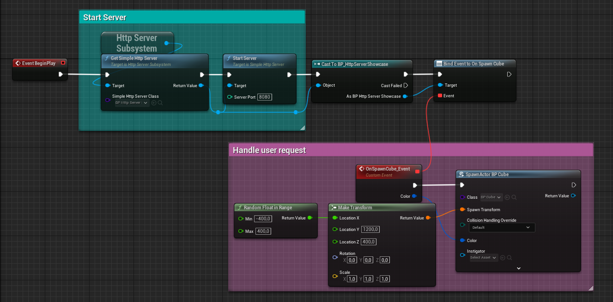
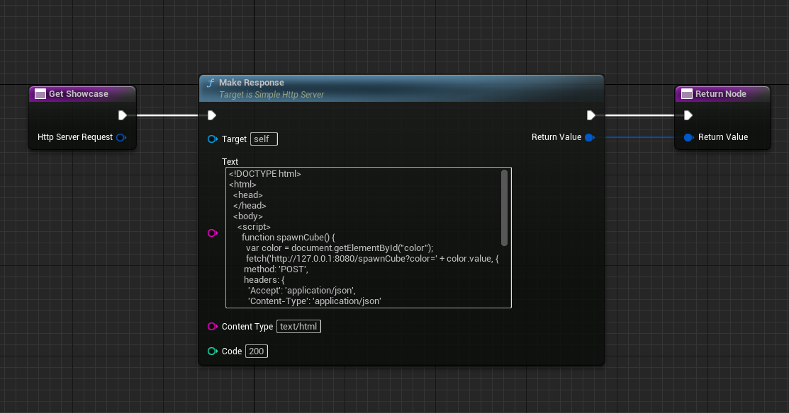
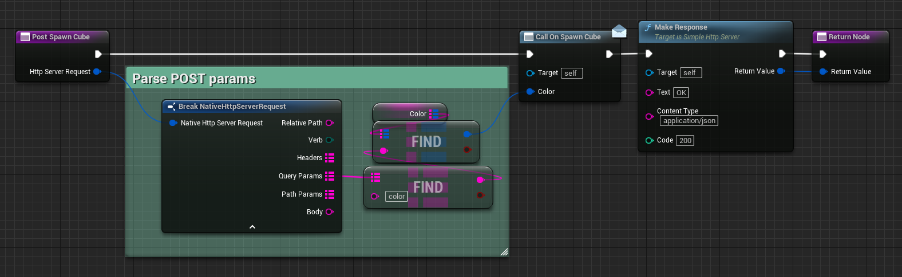

# Simple Blueprints and C++ HTTP Server for Unreal Engine 5

How to change default bind address https://github.com/Kaboms/UE-Simple-Http-Server/issues/1#issuecomment-2138905645

# Showcase
Easy to setup from Blueprints and C++

Support Blueprints bindings to HTTP routes

Showcase

